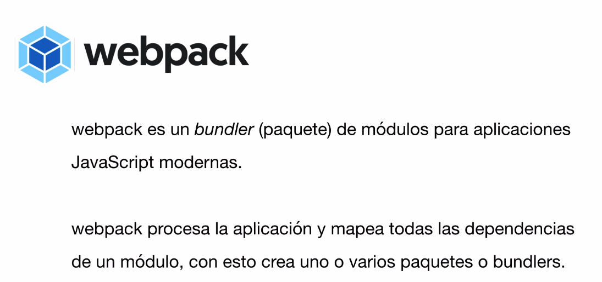
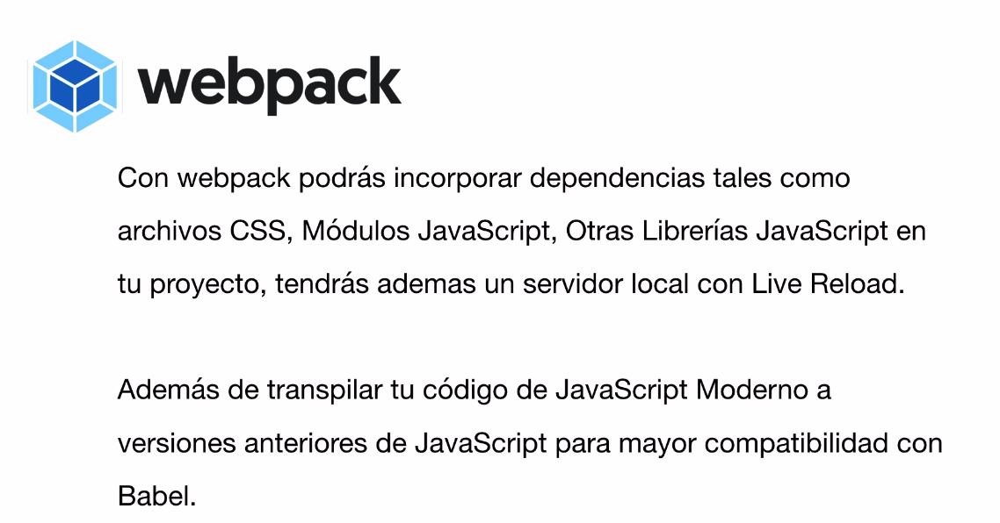
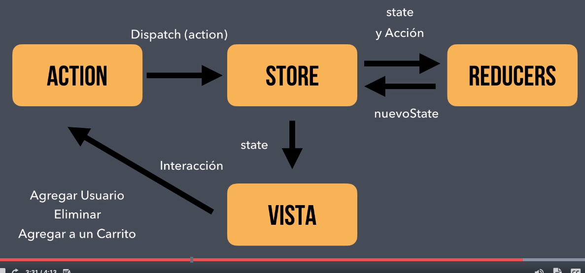

- [Introduccion y Bases](#introduccion-y-bases)
  - [Extensiones VSC](#extensiones-vsc)
  - [Extensiones Chrome](#extensiones-chrome)
  - [JSX](#jsx)
  - [Inicializacion proyecto](#inicializacion-proyecto)
- [Webpack](#webpack)
- [Funcionalidades](#funcionalidades)
  - [Props](#props)
  - [Fragment](#fragment)
  - [PropTypes](#proptypes)
  - [Emotion](#emotion)
  - [react-transition-group](#react-transition-group)
  - [react-router-dom](#react-router-dom)
  - [react-helment](#react-helment)
  - [gsap](#gsap)
- [React Hooks](#react-hooks)
  - [useState](#usestate)
  - [useEffect](#useeffect)
  - [useRef](#useref)
  - [useLayoutEffect](#uselayouteffect)
  - [useContext](#usecontext)
  - [useReducer](#usereducer)
- [Redux](#redux)
  - [Cuando utilizarlo](#cuando-utilizarlo)
  - [Principios](#principios)
  - [Instalacion](#instalacion)
- [Tailwind](#tailwind)
- [Next](#next)
  - [Server Side Rendering (SSR)](#server-side-rendering--ssr-)
  - [Aplicacion](#aplicacion)
  - [Deploy](#deploy)
- [Gatsby](#gatsby)
  - [JAMStack](#jamstack)
  - [Instalacion](#instalacion-1)
  - [Aplicacion](#aplicacion-1)
  - [Deploy](#deploy-1)
- [Testing](#testing)
  - [Tipos de Test](#tipos-de-test)
    - [End To End](#end-to-end)
    - [Integracion](#integracion)
    - [Unitarias](#unitarias)
    - [Static](#static)
  - [Herramientas recomendadas](#herramientas-recomendadas)
  - [Aplicacion](#aplicacion-2)
    - [Cleanup](#cleanup)
    - [afterEach](#aftereach)
    - [fireEvent](#fireevent)
    - [userEvent](#userevent)
    - [Test API](#test-api)
  - [Cypress](#cypress)

# Introduccion y Bases

Anteriormente los componentes se creaban como clases, hoy en dia se utilizan directamente funciones

## Extensiones VSC

- bracket pair colorizer
- es7 react/redux/grapQL ....
- simple react Snippets
- reactjs code snippets
- react/redux/react-router snippets
- generate-react-component (Este no)
- prettier - code formatter (Este no)

## Extensiones Chrome

- React Developer Tools
- Redux DevTools

## JSX

JavaScript con HTML

## Inicializacion proyecto

```sh
npx create-react-app nombre-del-proyecto

# with typescript
npx create-react-app project-name --template typescript
```

# Webpack

<br />
<br />

# Funcionalidades

## Props

Puedo pasar valores mediante props de componentes padres a hijos<br />

```jsx
// Padre
return (
  <Fragment>
    <Header titulo="Tienda Virtual" />
  </Fragment>
);

// Hijo
function Header({ titulo }) {
  return <h1 className="encabezado">{titulo}</h1>;
}
```

## Fragment

Un patrón común en React es que un componente devuelva múltiples elementos. Los Fragmentos te permiten agrupar una lista de hijos sin agregar nodos extra al DOM.

```jsx
import React, Fragment from 'react';

const Formulario = ({crearCita}) => {
    return (
        <Fragment>
            <h2>Crear Cita</h2>
            <form > </form>
            <footer>my footer</footer>
        </Fragment>
    );
}

export default Formulario;
```

## PropTypes

Nos permite documentar la aplicacion para saber que se le deben pasar a cada campo, van siempre abajo de todo

```jsx
import PropTypes from "prop-types";

const Formulario = ({ crearCita }) => {
  // TODO
};

Formulario.propTypes = {
  crearCita: PropTypes.func.isRequired, // es una funcion y es requerida
};

export default Formulario;
```

## Emotion

Forma mas simple de generar css y combinarlo con React

```jsx
import styled from "@emotion/styled";

const ContenedorHeader = styled.header`
  background-color: #26c6da;
  padding: 10px;
  font-weight: bold;
  color: #ffffff;
`;

const Header = ({ titulo }) => {
  return (
    <ContenedorHeader>
      <TextoHeader>{titulo}</TextoHeader>
    </ContenedorHeader>
  );
};
```

## react-transition-group

Nos permite realizar animaciones

## react-router-dom

Nos permite agregar ruteos en la aplicacion hacia los diferentes componentes

```jsx
import { BrowserRouter as Router, Switch, Route } from "react-router-dom";

// Componentes
import Login from "./components/auth/Login";
import NuevaCuenta from "./components/auth/NuevaCuenta";
import Proyectos from "./components/proyectos/Proyectos";

function App() {
  return (
    <Router>
      <Switch>
        <Route exact path="/" component={Login} />
        <Route exact path="/nueva-cuenta" component={NuevaCuenta} />
        <RutaPrivada exact path="/proyectos" component={Proyectos} />
      </Switch>
    </Router>
  );
}
```

## react-helment

Me permite modificar todo lo que esta arriba del body, se usa mas para SSR

## gsap

Me permite realizar animaciones:

```tsx
const counterElement = useRef<HTMLHeadingElement>(null);
useEffect(() => {
  const tl = gsap.timeline();

  tl.to(counterElement.current, { y: -10, duration: 0.2, ease: "ease.out" }).to(
    counterElement.current,
    { y: 0, duration: 1, ease: "bounce.out" }
  );
}, [counter]);
```

# React Hooks

Nos van a permitir actualizar el state sin necesidad de crear un **Class Component**<br />
El codigo es menor<br />
Mayor facilidad para implementar reducers, administrar el state y context<br />

**Algunos Hooks**

- useState
- useEffect
- useContext
- useRef
- useReducer
- useCallback
- useMemo

## useState

Me permite utilizar el state

```jsx
import React, { useState } from "react";

const [clientes, guardarCliente] = useState([]);

// cliente        -> tiene el state actual
// guardarCliente -> cambia el state, unicamente podemos cambiarlo de esta manera
```

## useEffect

Permite realizar ciertas operaciones cuando el state cambia, se ejecuta cuando el componente esta listo o cuando hay cambios en el componente.

```jsx
useEffect(() => {
  console.log("listo");
});
```

Para que se ejecute solo una vez debemos pasarle un array vacio

```jsx
useEffect(() => {
  console.log("listo");
}, []);
```

cada vez que cambie el state se ejecuta

```jsx
const [misValores, guardarMisValores] = useState([]);
useEffect(() => {
  console.log("listo");
}, [misValores]);
```

## useRef

me permite hacer referencia a un objeto HTML

```tsx
// HTMLHeadingElement es propio de ts
const counterElement = useRef<HTMLHeadingElement>(null);

// para obtener el elemento uso counterElement.current, obtener la referencia

// mantengo la referencia al elemento
return (
  <>
    <h2 ref={counterElement}>{counter}</h2>
  </>
);
```

## useLayoutEffect

Misma forma que useEffect, pero se ejecuta despues que se construyo el html

## useContext

Puedes pasar el state o funciones desde el componente principal hasta los hijos, sin necesidad de pasarlo por cada componente. Tambien se puede actualizar el state desde el hijo.

- Si el proyecto es sencillo, tal vez props sea una mejor opcion
- Context hace un poco mas commplicada la reutilizacion de componentes
  <br />

**Archivo Context**

```jsx
import React, { createContext, useState, useEffect } from "react";

// Crear el Context
export const CategoriasContext = createContext();

// Provider es donde se encuentran las funciones y state
const CategoriasProvider = (props) => {
  return (
    <CategoriasContext.Provider
      value={{
        categorias, // valores que van a estar disponibles en los difeentes componentes
      }}
    >
      {props.children} //De esta forma tomara los diferentes componentes que se
      pasaran por aca
    </CategoriasContext.Provider>
  );
};

export default CategoriasProvider;
```

<br />

**Archivo App.js**

```jsx
import CategoriasProvider from "./context/CategoriasContext";

function App() {
  return (
    <CategoriasProvider>
      {" "}
      // todo lo del context estara disponible dentro del tag
      <RecetasProvider>
        <ModalProvider>
          <Header />

          <div className="container mt-5">
            <div className="row">
              <Formulario />
            </div>

            <ListaRecetas />
          </div>
        </ModalProvider>
      </RecetasProvider>
    </CategoriasProvider>
  );
}
```

<br />

**Tomar el context en Formulario.js**

```jsx
import React, { useContext, useState } from "react";
import { CategoriasContext } from "../context/CategoriasContext";

const Formulario = () => {
  // vamos a tener disponible todo lo que este en el value
  const { categorias } = useContext(CategoriasContext);
};
```

## useReducer

Funciona igual que redux y con la sencilles de context

```jsx
const inicialState = {
  nuevoProyecto: false,
};
const [state, dispatch] = useReducer(proyectoReducer, initialState);
```

**reducer**

```jsx
import {
  FORMULARIO_PROYECTO,
  OBTENER_PROYECTOS,
  AGREGAR_PROYECTO,
  PROYECTO_ERROR,
  VALIDAR_FORMULARIO,
  PROYECTO_ACTUAL,
  ELIMINAR_PROYECTO,
} from "../../types";

export default (state, action) => {
  switch (action.type) {
    case FORMULARIO_PROYECTO:
      return {
        ...state,
        formulario: true,
      };
    case OBTENER_PROYECTOS:
      return {
        ...state,
        proyectos: action.payload,
      };
    case AGREGAR_PROYECTO:
      return {
        ...state,
        proyectos: [...state.proyectos, action.payload],
        formulario: false,
        errorformulario: false,
      };
    case VALIDAR_FORMULARIO:
      return {
        ...state,
        errorformulario: true,
      };
    case PROYECTO_ACTUAL:
      return {
        ...state,
        proyecto: state.proyectos.filter(
          (proyecto) => proyecto._id === action.payload
        ),
      };
    case ELIMINAR_PROYECTO:
      return {
        ...state,
        proyectos: state.proyectos.filter(
          (proyecto) => proyecto._id !== action.payload
        ),
        proyecto: null,
      };
    case PROYECTO_ERROR:
      return {
        ...state,
        mensaje: action.payload,
      };
    default:
      return state;
  }
};
```

# Redux

Va a permitir manejar el state de las aplicaciones mas facil conforme van creciendo.<br />

- Solo tiene un state principal (parecido a context)
- El state cambia de acuerdo a lo que sucede en la interfaz de usuario
- ciertas funciones van a cambiar el state
- el usuario es el que utiliza estas funciones y cambia el state

## Cuando utilizarlo

Si la aplicacion es sencilla y pequeña no se necesita utilizar Redux, utilizar mejor hooks o context
<br /><br />
Si la aplicacion es grande y sera mantenida por varias personas, Redux sera de gran ayuda<br /><br />

## Principios

- Solo existe un store con todo el state de la aplicacion
- Componentes o vistas no deben modificar el state directamente
- El state se modifica por medio de funciones (actions)

<br />

**Store** -> contiene el state (1 por aplicacion)<br />
**Dispatch** -> ejecuta una accion que utiliza el state<br />
**Actions** -> objetos js, tienen un tipo y payload (datos)<br />
**Suscribe** -> similar a un event listener para el state<br />
**Reducers** -> Funciones que saben que hacer con las acciones y el payload<br />

<br />

## Instalacion

**redux** -> instala redux<br />
**react-redux** -> asocia react con redux<br />
**redux-thunk** -> me permite utilizar redux de forma asincrona<br />

# Tailwind

## Setup

```sh
npx create-react-app project-name --template typescript
cb project-name

npm install -D tailwindcss postcss autoprefixer
npx tailwindcss init -p
```

configure tailwind.config.js file:

```js
/** @type {import('tailwindcss').Config} */
module.exports = {
  content: ["./src/**/*.{js,jsx,ts,tsx}"],
  theme: {
    extend: {},
  },
  plugins: [],
};
```

add the tailwind directives to your CSS (index.css)

```css
@tailwind base;
@tailwind components;
@tailwind utilities;
```

run project

```sh
npm start
```

# Next

Me permite crear sitios web utilizando Server Site Rendering

## Server Side Rendering (SSR)

Es el servidor el que se encarga de generar el HTML<br />

**Beneficios**

- El sitio web carga mas rapido ya que los recursos de la computadora no son utilizados sino que el del servidor
- Se recomienda para aplicaciones grandes o aplicaciones que van a crecer a futuro
- Mejora el SEO

## Aplicacion

```sh
# crear proyecto
npx create-next-app myproject

# correr local
npm run dev


```

**pages**<br />
genero las paginas, automaticamente genera las paginas a medida que las vamos agregando aca

## Deploy

Para deployar debemos ejecutar el build

```sh
# Exportamos el proyecto, nos genera una carpeta out que es lo que vamos a subir
next export # o bien -> npm run export, debemos ejecutar primero el build

npm run build
# en lugar de usar public utilizamos out
```

# Gatsby

- Excelente velocidad de carga
- Sitios estaticos con React
- mas avanzado que Next.JS
  <br />

**¿Que es Gatsby?**<br />

- Es un generador de sitios web estaticos, al final te crea una serie de archivos HTML
- Utiliza React, Webpack, GraphQL, ES6+, CSS
- Utiliza **JAMStack** (presente y futuro del desarrollo web)
- Su principal caracteristica es la creacion de sitios web de gran velocidad

## JAMStack

**J**avascript<br />
**A**pi<br />
**M**arkup (codigo HTML)<br />

**Beneficios de JAMStack y sitios estaticos**

- Velicidad (la velocidad es importante para posicionarse primero en las busquedas)
- Seguridad (queda separado el back del front)
- Bajo coste (debido a SSR), obtiene los datos desde la API y no de la BD
- Se pueden utilizar sin conexion a internet, se puede crear PWA
- Escalable
  <br />

Gastby crea archivos estaticos cada vez que el usuario ingresa al sitio web, ahorra el tener que ir a una BD, pero si tienes un sitio web, por ejemplo, de noticias que cada 5 minutos se sube una noticia, propablemente **Gatsby no sea tu mejor opcion** ya que crea archivos estaticos de la base de datos, no es en tiempo real

## Instalacion

```sh
npm i -g gatsby-cli

gatsby new myproject # creo un nuevo proyecto
cd myproject
gatsby develop # levanto la app local
```

## Aplicacion

Podemos hacer consultas a gatsby, por ejemplo las imagenes que tiene en el filesystem, mediante graphQL en /\_\_\_grapqh<br />
Los archivos estaticos los vamos a obtener mediante graphQL desde la aplicacion<br />
Gatsby te mejora y optimiza las imagenes para que pesen menos al momento de obtenerlas<br />

## Deploy

```sh
gatsby build # Todo se coloca en la carpeta public

```

# Testing

## Tipos de Test

### End To End

Se comporta como el usuario, da clicks y llena formularios

### Integracion

Revisa que varias partes de la aplicacion funcionen bien juntas, a un arbol de componentes

### Unitarias

Una parte por si sola funciona bien, a un componente

### Static

Identificas errores mientras los vas escribiendo

## Herramientas recomendadas

- Jest
- React Testing Library (Incluido en CRA)
- Cypress (me va a permmitir hacer test E2E)<br />
  (CRA: Create React App)<br /><br />
  **Escribe pruebas, no muchas. La mayoria de integracion**<br />

## Aplicacion

- podemos crear un archivo con **xxx.test.js o xxx.spec.js**
- podemos crear un folder **\__tests_ \_** y poner las pruebas ahi

```js
// en Jest podemos usar tanto it como test
test("mi prueba", () => {});

it("mi prueba", () => {});
```

```js
import React from "react";
import Formulario from "../components/Formulario";
import { render } from "@testing-library/react";
import "@testing-library/jest-dom/extend-expect"; // para utilizat toBeInTheDocument();

test("<Formulario /> Cargar el formulario y revisar que sea correcto", () => {
  const wrapper = render(<Formulario />);
  wrapper.debug(); // me permite mostrar el componente entero

  expect(wrapper.getByText("Crear Cita")).toBeInTheDocument();
});
```

```js
// podemos utilizar screen para un codigo mas limpio
import React from "react";
import Formulario from "../components/Formulario";
import { render, screen } from "@testing-library/react";
import "@testing-library/jest-dom/extend-expect";

test("<Formulario /> Cargar el formulario y revisar que sea correcto", () => {
  render(<Formulario />);
  expect(screen.getByText("Crear Cita")).toBeInTheDocument();
});
```

```js
// se recomienda agregar un id de test a los elementos

return (
        <Fragment>
            <h2 data-testid="titulo">Crear Cita</h2>

            ...
```

### Cleanup

Me permite limpiar un componente una vez utilizado, pero en las ultimas versiones ya no se usa, se limpian automaticamente

### afterEach

Me permite ejecutar algo antes de cada prueba

### fireEvent

Me permite ejecutar eventos, pero en las ultimas versiones ya no se utiliza

```js
const btn = screen.getByTestId("myID");
fireEvent.click(btn);

// Espero que se muestre una alerta al presionar el boton, por ejemplo
```

```js
// pasar valores al formulario
fireEvent.change(screen.getByTestId("mascota"), {
  target: {
    value: "Paquito",
  },
});
```

### userEvent

Me permite ejecutar eventos, es el que se utiliza ahora

```js
// vamos a escribir en el form
userEvent.type(screen.getByTestId("mascota"), "Paquito");

const btn = screen.getByTestId("btn-submit");
userEvent.click(btn); // dar click

// Lugo de oprimir el boton
```

### Test API

En lugar de ir a consultar una API utilizaremos mocks, agregariamos un folder **\__mocks_ \_**

```js
import React from "react";
import { render, screen } from "@testing-library/react";
import Formulario from "../components/Formulario";
import { monedas, criptos } from "../__mocks__/criptomonedas";
import axios from "axios";

const mockAxios = axios;

test("<useCriptomonedas />", async () => {
  // le mandamos los mocks al request, sin necesidad que consulte la api
  mockAxios.get = jest.fn().mockResolvedValue({
    data: criptos,
  });

  render(<Formulario />);

  const monedasDropdown = screen.getByTestId("select-monedas");
  expect(monedasDropdown.children.length).toEqual(monedas.length + 1);

  const opciones = await screen.findAllByTestId("criptos");
  expect(opciones).toHaveLength(2);
});
```

## Cypress

Nos permite realizar lo mismo que el usuario, parecido a selenium

```js
npm i --save-dev cypress
npx cypress open
```
